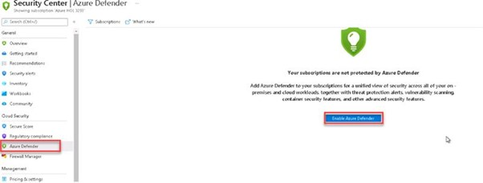

## Exercise 1: Implementing Just-in-Time (JIT) access

Duration: 15 minutes

Synopsis: In this exercise, attendees will secure a Privileged Access Workstation (PAW) workstation using the Azure Security Center Just-in-Time Access feature.

### Task 1: Setup virtual machine with JIT

1. In a browser, navigate to your Azure portal (<https://portal.azure.com>).

2. Select **Security Center,** then under **ADVANCED CLOUD DEFENSE** select **Just in time VM access**.

    

    > **Note**: Your subscription may not be set up with the **Standard** tier; if that is the case then do the following:

   - In the **Security Center** blade, select **Azure Defender**.
   - Select **Enable Azure Defender**.
   
   
   

3. Select the **Configured** tab, and verify the lab VMs (db-1, paw-1 and web-1) are displayed.  If not, select the **Recommended** tab, and then check the checkbox to select the lab VMs (db-1, paw-1 and web-1), and then select the **Enable JIT on 3 VMs** link.

    

    > **Note**: It could take up to 10 minutes for new VMs to show up if you upgraded to standard tier security.  Also note that it is possible new VMs display in the **No recommendation** tab until a backend process moves them to the **Recommended** tab.  In you find the VMs do not show up after 10 minutes, you can manually enable JIT by choosing the **Configuration** tab in the VMs configuration blade and then **Enable JIT Access**. Do the same for all the VMs.

    

4. In the configuration window that opens, review the settings, then select **Save**.

    

5. After a few minutes, you should see the states changed to **Resolved**.  If this does not occur due to UI changes, then browse back to the **Configured** tab. 
   

### Task 2: Perform a JIT request

1. Select the **Configured** tab. You should now see all the machines listed.

2. Select the **paw-1** virtual machine, and then select **Request access**.

    

3. For each of the ports, select the **On** toggle button, notice how the default IP settings is **My IP**.

    

4. At the bottom of the dialog, select **Open ports**. After a few moments, you should now see the **APPROVED** requests have been incremented and the **Last Access** is set to **Active now.**.

    

    > **Note**  If you did not wait for your VMs and virtual networks to be fully provisioned via the ARM template, you may get an error.

5. Select the ellipses, then select **Activity Log**, you will be able to see a history of who requests access to the virtual machines.

    

    > **Note**: These entries will persist after you have deleted the VMs. You will need to manually remove them after VM deletion.

6. In the Azure Portal main menu, select **All Services**, then type **Network**, then select **Network security groups**.

    

7. In the filter textbox, type **paw-1-nsg**, then select the **paw-1-nsg** network security group.

8. Select **Inbound security rules.** You should now see inbound security rules set up by JIT Access.

    
